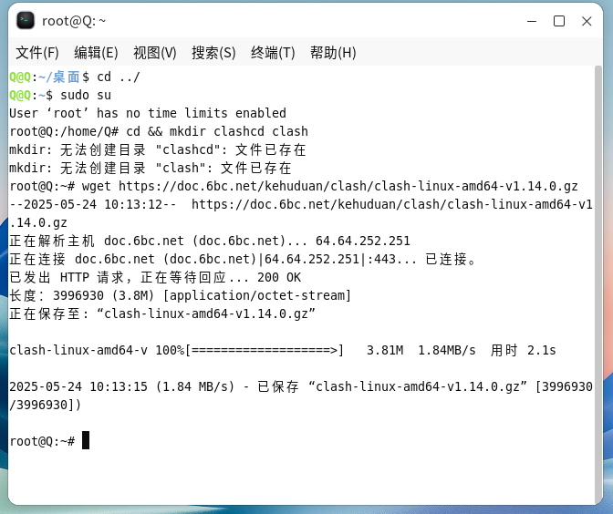
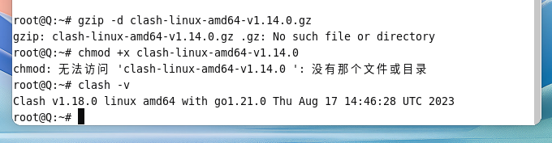
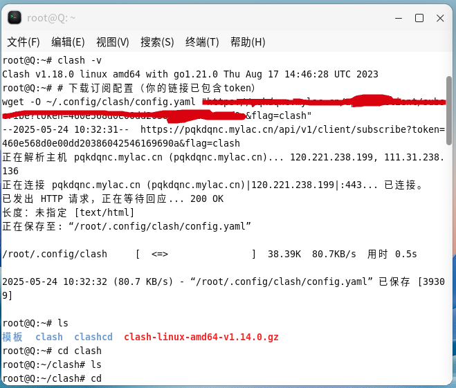
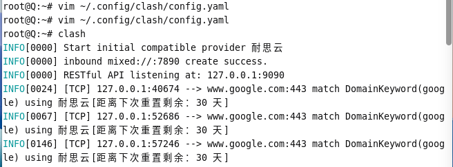
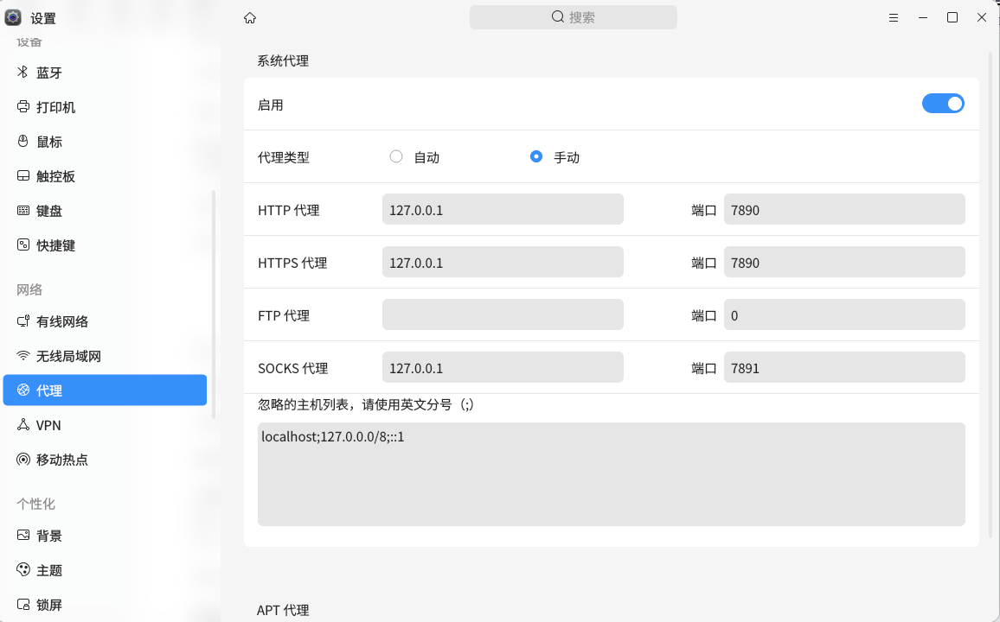
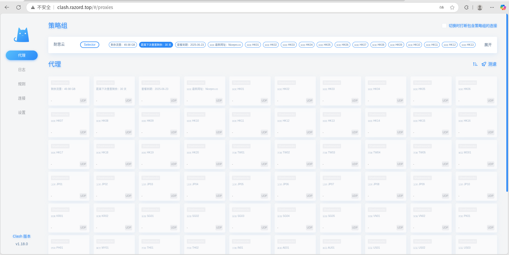

# 在Linux操作系统上配置Clash教程

今天博主教大家如何在Linux操作系统上配置Clash，这个过程博主昨天才学会，并且踩了不少坑。本期教程仅适用于Debian系列系统，在Linux Mint和银河麒麟上测试通过。

### 步骤一：下载并安装Clash

1. 在根目录下打开终端，切换到超级管理员权限，创建Clash文件夹。

```
# 切换超级管理员
su  # 或者执行sudo su
 
# 创建文件夹 
cd && mkdir clashcd clash 
 
# 本站下载文件 
wget https://doc.6bc.net/kehuduan/clash/clash-linux-amd64-v1.14.0.gz
```



2. 下载完成后进行解压文件，给予文件权限。

   ```bash
   # 解压文件 
   gzip -d clash-linux-amd64-v1.14.0.gz 
    
   # 给予权限 
   chmod +x clash-linux-amd64-v1.14.0 
    
   # 查看版本 
   clash -v
   ```



## 步骤二：启动Clash并生成config.yaml

```
# 启动
clash
 
# 进入目录 
cd $HOME/.config/clash/ 
 
# 导入订阅 （这里的订阅地址通过一个“”包起来，同时在地址的后面加上&flag=clash）
wget -O config.yaml 订阅地址 
在执行完这一步之后，可以去config.yaml里面配置规则之类的，比如绕过大陆这些配置，由于每个人的需求不同，这里的话我就不再过多的讲了，大家有兴趣的可以自己去看看需要配置什么
 
# 启动
clash
```





## 步骤三：测试Clash配置

分别执行以下命令测试国内和国外网站访问情况。

```bash
# 测试国内网站 curl -v http://www.baidu.com

# 测试国外网站 curl --proxy http://127.0.0.1:7890 https://www.google.com
```

如果返回HTML内容则说明配置成功。

## 步骤四：配置网络代理

按照上述步骤设置浏览器的网络代理后，尝试访问Google等网站。如果无法访问，请检查代理设置是否正确。



## 步骤五：节点管理

可以通过访问 `http://clash.razord.top/#/proxies` 来进行节点管理和切换。



## 注意事项

- 如果关闭Clash后无法上网，请确保已关闭之前设置的网络代理。
- 可以设置开机自启动Clash，但本教程未涉及此部分。
```

请注意替换实际使用的命令和路径，确保与您的环境匹配。